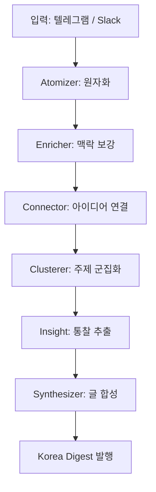

## 개요

> **요약**: Korea Digest는 Synapse 지식 운영 시스템이 한국의 주요 이슈와 인사이트를 자동으로 정제·발행하는 채널입니다. 원자화된 생각이 구조화된 글로 변환되어 독자에게 전달됩니다.

Korea Digest는 분산된 정보를 하나의 응집된 시각으로 재구성한다.

## 발행 파이프라인 비교

| 단계 | 기존 방식 | Synapse 방식 |
|------|-----------|-------------|
| 정보 수집 | 수동 큐레이션 | 다채널 자동 수집 |
| 분석 | 개인 주관 | AI 원자화 + 벡터 연결 |
| 구조화 | 직접 작성 | Clusterer 자동 군집 |
| 발행 | 단일 플랫폼 | 다매체 동시 발행 |
| 원본 보존 | 수정 가능 | 원본 불변 원칙 |

## 처리 흐름

## Korea Digest의 특징

Korea Digest가 지향하는 세 가지 원칙:

1. **정제된 인사이트** — 노이즈를 제거하고 핵심만 전달한다.
2. **구조화된 서사** — 단편적 정보를 맥락 있는 이야기로 연결한다.
3. **원본 불변** — 입력된 원문은 수정하지 않고 분석 레이어에만 기록한다.

## 결론

Korea Digest는 Synapse의 지식 파이프라인이 만들어내는 첫 번째 정기 발행물이다. 앞으로 다양한 주제의 인사이트가 이 채널을 통해 전달될 예정이다.
